# 📋 التقرير التقني الشامل والمصور لنظام ImagePro Studio
### التوثيق الهندسي لكافة أجزاء ومحركات النظام مدعماً بلقطات الشاشة المحدثة للوضعين النهاري والليلي
> **جامعة إب • كلية الحاسوب وتكنولوجيا المعلومات**  
> **مشروع تخرج لنيل درجة البكالوريوس في علوم الحاسوب**  
> **تخصص:** معالجة الصور الرقمية والرؤية الحاسوبية (Digital Image Processing & Computer Vision)  
> **إعداد المهندسين:**  
> • **سليمان العربي**  
> • **يعقوب المهاجري**  
> • **مالك عادل**  
> **العام الجامعي:** 2025 - 2026 م | **تاريخ التوثيق النهائي:** سبتمبر 2026  

---

## 📑 فهرس التقرير
1. [المقدمة والملخص التنفيذي](#1-المقدمة-والملخص-التنفيذي)
2. [المعمارية الهندسية ومخطط تدفق البيانات](#2-المعمارية-الهندسية-ومخطط-تدفق-البيانات)
3. [مصفوفة الاعتماديات والمكتبات البرمجية](#3-مصفوفة-الاعتماديات-والمكتبات-البرمجية)
4. [توثيق واجهات ومساحة العمل (الوضعان النهاري والليلي)](#4-توثيق-واجهات-ومساحة-العمل)
5. [توثيق النوافذ الإبداعية والاستوديوهات](#5-توثيق-النوافذ-الإبداعية-والاستوديوهات)
6. [محركات المعالجة البكسلية والرياضية](#6-محركات-المعالجة-البكسلية-والرياضية)
7. [استوديو الذكاء الاصطناعي وشبكة IS-Net](#7-استوديو-الذكاء-الاصطناعي-وشبكة-is-net)
8. [العلامة المائية ومحرك التصدير متعدد المقاسات](#8-العلامة-المائية-ومحرك-التصدير-متعدد-المقاسات)
9. [بيئة الاختبارات وضمان الجودة البرمجية (70 اختباراً ناجحاً بنسبة 100%)](#9-بيئة-الاختبارات-وضمان-الجودة-البرمجية)
10. [الخاتمة والتوصيات المستقبلية](#10-الخاتمة-والتوصيات-المستقبلية)

---

## 1. المقدمة والملخص التنفيذي
نظام **ImagePro Studio** هو منصة برمجية هندسية متكاملة لتحرير ومعالجة الصور الرقمية وتطبيق خوارزميات الرؤية الحاسوبية والذكاء الاصطناعي مباشرة عبر الويب. تم بناء النظام ليعمل بكفاءة فائقة تعتمد على المعالجة الرياضية النقطية المباشرة (Pixel-level manipulation) دون الاعتماد على مكاتب تجارية مغلقة، حيث تم بناء محركات معالجة رياضية مخصصة من الصفر لكل من الفلاتر، التعديلات الضوئية، الرسم، التنقيح، والمحاذاة، مع دمج شبكة **IS-Net** العصبية العميقة لتفريغ الأجسام وعزل البورتريه بدقة متناهية.

---

## 2. المعمارية الهندسية ومخطط تدفق البيانات
يعتمد النظام على معمارية هجينة متعددة المستويات (Hybrid Multi-Tier Architecture):
```
+-----------------------------------------------------------------------------------+
|                        1. طبقة واجهة المستخدم وتجربة الاستخدام                     |
|           Two-Tier Command Bar (System Tier 1 + Studio Hero Ribbon Tier 2)        |
|                 React 19 + Tailwind CSS v4 + Radix UI + Lucide                    |
+-----------------------------------------------------------------------------------+
                                         │
                                         ▼
+-----------------------------------------------------------------------------------+
|                     2. طبقة إدارة الحالة وتدفق البيانات (State)                   |
|     Canvas Context + Tool Registry + Layers Stack + Snap Engine + History Memento |
+-----------------------------------------------------------------------------------+
        │                                                     │
        ▼                                                     ▼
+------------------------------------+   +------------------------------------------+
|  3. محركات المعالجة المحلية للعميل |   |     4. الواجهة الخلفية والذكاء الاصطناعي |
|     (Client-side Web Engines)      |   |            (Node.js / Express API)       |
| • محرك الكانفاس (HTML5 Canvas 2D)  |   | • خادم Express 4.21                      |
| • محرك الفلاتر (Convolution 3x3)   |   | • مكتبة Sharp (C++ Libvips)              |
| • محرك الإضاءة والهستوجرام الحسابي |   | • نموذج IS-Net العصبي (ONNX Runtime)     |
| • محرك التنعيم التربيعي للفرشاة    |   | • إزالة الخلفية الذكية ومناطق ROI        |
| • خوارزميات التنقيح (Bilateral/IDW)|   |                                          |
+------------------------------------+   +------------------------------------------+
                                         │
                                         ▼
+-----------------------------------------------------------------------------------+
|            5. طبقة التخزين وإدارة المشاريع (Persistence & Export Engine)          |
| Autosave Manager (Local Storage) + Version History + .imagepro Bundles + ZIP Exp  |
+-----------------------------------------------------------------------------------+
```

---

## 3. مصفوفة الاعتماديات والمكتبات البرمجية
| المكتبة | الإصدار | التصنيف | الدور الوظيفي داخل النظام |
|---|:---:|:---:|---|
| **`react`** | `^19.2.1` | Core Framework | إطار العمل الأساسي لإدارة الواجهة التفاعلية. |
| **`react-dom`** | `^19.2.1` | Core Framework | ربط مكونات React بشجرة DOM الحقيقية للمتصفح. |
| **`@imgly/background-removal`** | `^1.7.0` | AI / Computer Vision | تشغيل نموذج IS-Net في المتصفح عبر Web Workers. |
| **`sharp`** | `^0.35.4` | Image Processing | مكتبة C++ مدمجة بالسيرفر لمعالجة الصور وإدارة مناطق ROI. |
| **`express`** | `^4.21.2` | Backend Server | خادم الويب الأساسي لخدمة واجهات API. |
| **`lucide-react`** | `^0.453.0` | UI Icons | توفير كافة الأيقونات المتجهة لأدوات النظام. |
| **`recharts`** | `^2.15.2` | Data Visualization | رسم بياني عالي الدقة لعرض الهيستوجرام اللحظي لقنوات الألوان. |
| **`vitest`** | `^2.1.8` | Quality Assurance | منصة الاختبارات الآلية التي تشغل 70 اختبار وحدة شاملة. |

---

## 4. توثيق واجهات ومساحة العمل

### الشكل 1: مساحة العمل المتكاملة لنظام ImagePro Studio (الوضع النهاري الفاتح)
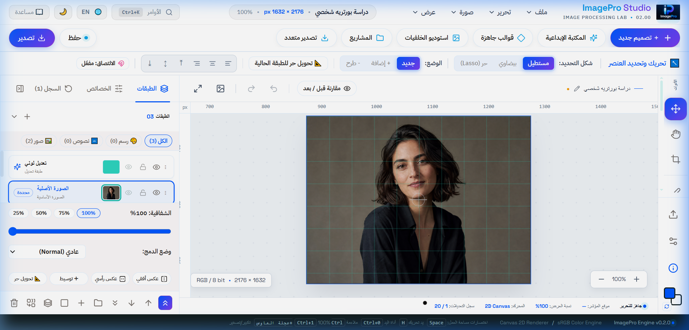
> **الشرح الفني الشامل:**  
> **1. المكونات والأجزاء المرئية:**
> - **شعار المنصة الرسمي وبطاقة الإصدار (أعلى اليمين):** أيقونة العدسة والكاميرا التجريدية بألوان أطياف الضوء مع اسم النظام `ImagePro Studio` وبطاقة الإصدار `v3.2.0 Pro`.
> - **شريط النظام العلوي (Tier 1 Menu Bar):** يحتوي على القوائم الرئيسية السبع: ملف (File)، تعديل (Edit)، صورة (Image)، طبقة (Layer)، مرشحات (Filter)، عرض (View)، ومساعدة (Help)، إلى جانب زري التراجع والإعادة (Undo/Redo) ومؤشر حفظ المشروع.
> - **شريط استوديو الإبداع (Tier 2 Hero Ribbon):** شريط كبسولي عائم يضم أزرار الوظائف الكبرى: زر «＋ تصميم جديد»، «المكتبة الإبداعية»، «قوالب جاهزة»، «استوديو الخلفيات»، «المشاريع»، و«تصدير متعدد».
> - **صندوق الأدوات الرأسي الأيسر (Primary Toolbar):** يضم 12 أداة هندسية متكاملة:
>   - أداة التحريك والتحديد الحر (Move & Transform - V)
>   - أداة التحديد المستطيلي والبيضاوي (Marquee Select - M)
>   - أداة حبل التحديد الحر والمضلع (Lasso Tool - L)
>   - أداة العصا السحرية (Magic Wand - W)
>   - أداة الفرشاة الفنية (Brush Tool - B)
>   - أداة الممحاة (Eraser - E)
>   - أداة سطل الطلاء والملء الفيضاني (Paint Bucket - G)
>   - أداة النصوص المطبعية (Typography Tool - T)
>   - أداة الأشكال المتجهة (Shapes Tool - U)
>   - أداة القطارة اللونية (Eyedropper - I)
>   - أداة اليد للتجول (Hand Tool - H)
>   - أداة التكبير والتصغير (Zoom Tool - Z)
>   - عينات الألوان الأمامية والخلفية (Foreground/Background Swatches) وزر المبادلة السريعة (X).
> - **منطقة الكانفاس المركزية (Canvas Viewport):** مسطح العمل بدقة $2176 \times 1632$ بكسل محاط بمساطر بكسلية متدرجة ديناميكياً وأدلة محاذاة مغناطيسية ذكية (Smart Snapping Guides).
> - **شريط الحالة السفلي (Status Bar):** يعرض إحداثيات مؤشر الفأرة الحية $(X, Y)$، نسبة التكبير، ونمط الألوان sRGB 8-bit.

---

### الشكل 2: مساحة العمل المحدثة في الوضع الليلي (Dark Studio Mode)
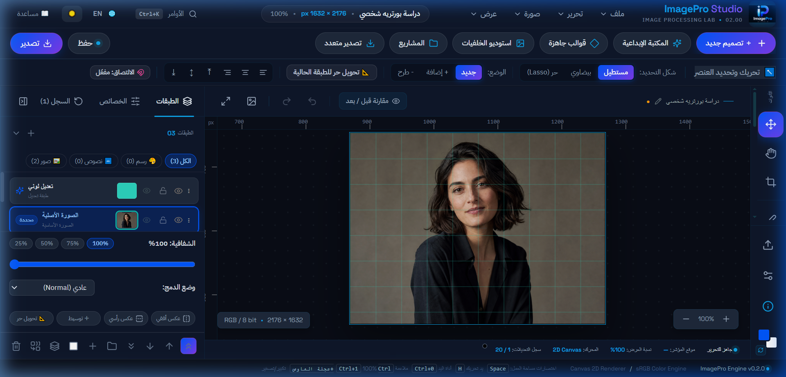
> **الشرح الفني الشامل:**  
> **1. سمة الاستوديو المظلمة (Dark Slate Theme):** بيئة داكنة متناسقة (#0f172a / #1e293b) تحمي عين المصمم وتوفر تبايناً بصرياً فائق الدقة.  
> **2. لوحة الطبقات النشطة (Layers Panel):**
> - **أزرار الترويسة:** زر إضافة طبقة جديدة (+)، زر تكرار الطبقة (Duplicate)، وزر حذف الطبقة (Trash).
> - **قائمة أنماط الدمج (17 Blending Modes):** Normal, Multiply, Screen, Overlay, Soft Light, Hard Light, Color Dodge وغيرها.
> - **منزلق عتامة الطبقة (Layer Opacity Slider):** تحكم دقيق من 0% إلى 100%.
> - **قائمة الطبقات التراكمية (Layers Stack):** معاينات مصغرة حية لكل طبقة، زر إظهار/إخفاء (Eye Toggle)، قفل الطبقة (Lock Layer)، وإعادة الترتيب الرأسي بالسحب والإفلات (Drag & Drop Z-Index).
> - **الأساس الرياضي:** حفظ كل طبقة في كائن مستقل بـ `ImageData` ومصفوفة تحويل `TransformMatrix` لضمان التصيير غير التدميري.

---

### الشكل 3: استوديو أدوات الخصائص والفرش في الوضع الليلي
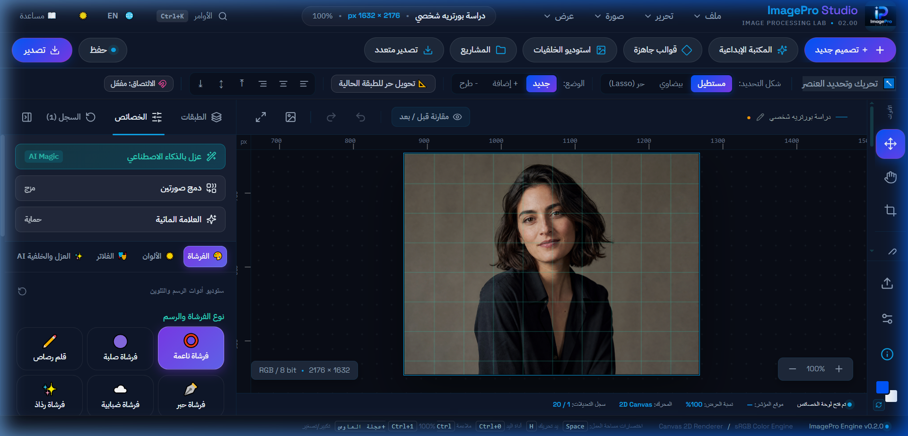
> **الشرح الفني الشامل:**  
> **1. كبسولات الاستوديو السريعة الثلاث الكبرى:**
> - **عزل بالذكاء الاصطناعي (AI Magic):** استدعاء نافذة العزل العصبي بنقرة واحدة.
> - **دمج صورتين (Blend Images):** فتح أداة المزج المتقدم بين طبقتين بأنماط رياضية وأقنعة تدرجية.
> - **العلامة المائية (Watermark):** استدعاء أداة حماية الحقوق الفكرية الفورية.
> 
> **2. أنماط وتخصيص الفرشاة:**
> - **4 أنماط جاهزة:** فرشاة ناعمة (Soft Round)، فرشاة صلبة (Hard Round)، ريشة خط وحبر (Calligraphy)، ومرذاذ هواء (Airbrush).
> - **منزلقات التحكم:** الحجم (Size من 1 إلى 200 بكسل مع معاينة حية)، صلابة الحواف (Hardness %)، ونسبة العتامة والتدفق (Opacity %).

---

### الشكل 4: شريط استوديو الإبداع الموحد (Hero Ribbon Tier 2)
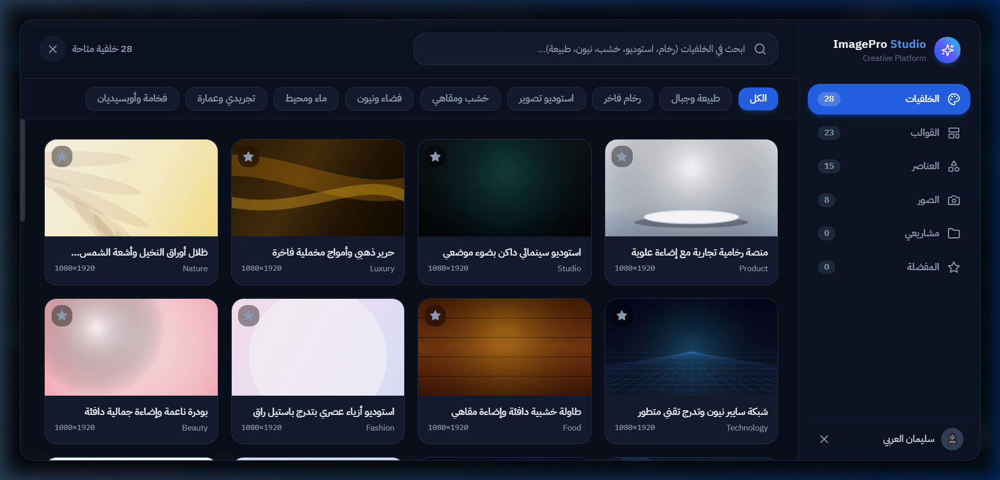
> **الشرح الفني الشامل:**  
> شريط عائم شبه شفاف يجمع الوظائف الكبرى الأكثر استخداماً:
> - **زر «＋ تصميم جديد»:** تهيئة مشروع جديد بالمقاسات الجاهزة أو المخصصة.
> - **زر «المكتبة الإبداعية»:** مستودع الأصول المتجهة وصور الستوك والملصقات القابلة للسحب والإفلات.
> - **زر «قوالب جاهزة»:** استعراض مكتبة القوالب التسويقية والاجتماعية متعددة الطبقات.
> - **زر «استوديو الخلفيات»:** تصفح خلفيات تصوير المنتجات، المنصات، والبورتريه.
> - **زر «المشاريع»:** فتح لوحة إدارة المشاريع المحلية وسجل النسخ وسلة المهملات.
> - **زر «تصدير متعدد»:** التصدير المجمع لشبكات التواصل في أرشيف ZIP.

---

### الشكل 5: لوحة الأوامر الفورية (Command Palette - `Ctrl + K`)
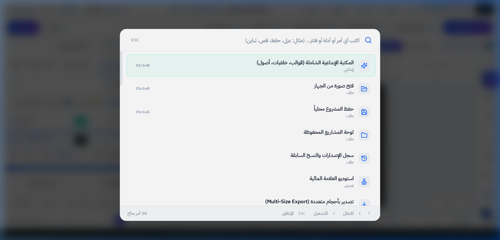
> **الشرح الفني الشامل:**  
> واجهة تحكم فورية فائقة السرعة:
> - **محرك المطابقة التقريبية (Fuzzy Matching):** يتيح البحث الذكي عن الأوامر حتى مع الأخطاء الإملائية.
> - **التصنيف الهيكلي للنتائج:** تصنيف الأوامر إلى أدوات التصميم (Tools)، الفلاتر (Filters)، النوافذ (Modals)، وعمليات التصدير والحفظ (Actions).
> - **بطاقات الاختصارات:** إظهار اختصارات الكيبورد بجانب كل خيار (مثل `B` للفرشاة، `Ctrl+Z` للتراجع).
> - **التنفيذ من لوحة المفاتيح:** التنقل بالأسهم والضغط على `Enter` للتنفيذ الفوري.

---

## 5. توثيق النوافذ الإبداعية والاستوديوهات

### الشكل 6: نافذة بدء التصميم والمقاسات الجاهزة
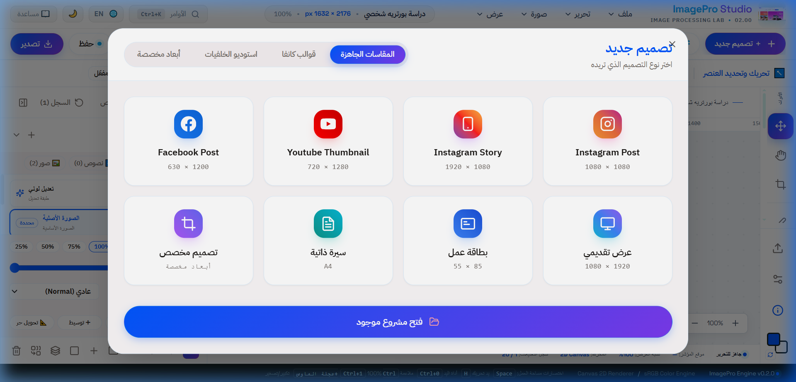
> **الشرح الفني الشامل:**  
> واجهة تهيئة المشاريع وفق المقاييس العالمية:
> - **مقاسات السوشيال ميديا:** فيسبوك بوست ($1200 \times 630$)، بوست انستغرام ($1080 \times 1080$)، ستوري انستغرام وتيك توك ($1080 \times 1920$)، يوتيوب ثامبنيل ($1280 \times 720$)، وغلاف تويتر ($1500 \times 500$).
> - **المطبوعات والأعمال:** مستند A4 طباعي بدقة 300 DPI، بطاقة عمل ($1050 \times 600$)، وبوستر إعلاني A3.
> - **الأبعاد المخصصة:** إدخال الطول والعرض بالبكسل مع زر قفل نسبة التناسب لمنع التشوه.
> - **لون الخلفية البدائي:** شفاف، أبيض نقي، أسود استوديو، أو لون مخصص.
> - **زر الإجراء:** «إنشاء مساحة العمل» لتهيئة الكانفاس والمساطر تلقائياً.

---

### الشكل 7: المكتبة الإبداعية الشاملة للأصول
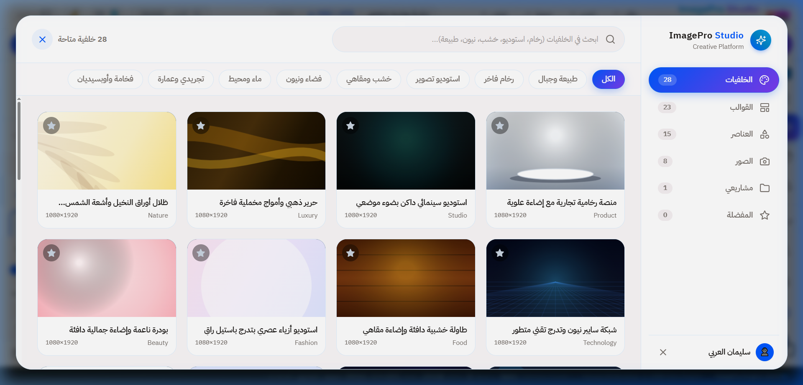
> **الشرح الفني الشامل:**  
> مستودع أصول تصميم رقمية متكامل:
> - **قسم الرسومات المتجهة (Vector Elements):** مئات الرموز والأشكال المرسومة برمجياً بدوال `Canvas 2D Path` دون الحاجة لملفات صور ثقيلة، مما يوفر دقة متناهية وسرعة فائقة.
> - **مستودع صور الستوك (Stock Photos):** صور فوتوغرافية احترافية عالية الدقة مصنفة ومجهزة للإدراج كطبقة جديدة.
> - **الملصقات والشارات (Stickers & Badges):** شرائط الخصومات، أختام الجودة، والأشكال الترويجية.
> - **محرك السحب والإفلات الذكي:** سحب أي عنصر وإفلاته في أي موقع على الكانفاس لتوليد طبقة جديدة في نفس الإحداثيات فوراً.

---

### الشكل 8: استوديو القوالب الجاهزة متعددة الطبقات
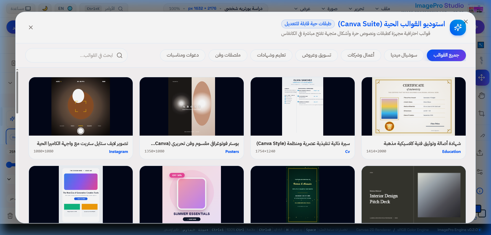
> **الشرح الفني الشامل:**  
> قوالب تصميمية مسبقة الصنع قابلة للتعديل بجميع طبقاتها:
> - **التصنيفات الوظيفية:** قوالب تسويقية، إعلانات السوشيال ميديا، بطاقات المناسبات، والملصقات الترويجية.
> - **تفكيك القالب الطبقي (Layer Decomposition):** عند اختيار أي قالب، يتم توليد شجرة طبقات كاملة في الكانفاس تحوي طبقة الخلفية، الكتل الهندسية، طبقات النصوص العربية والإنجليزية القابلة للتحرير، وشارات الأسعار والشعارات.
> - **المزامنة التلقائية للخطوط والألوان:** تطبيق سمة القالب الجمالية لحظياً.

---

### الشكل 9: استوديو الخلفيات لتصوير المنتجات والبورتريه
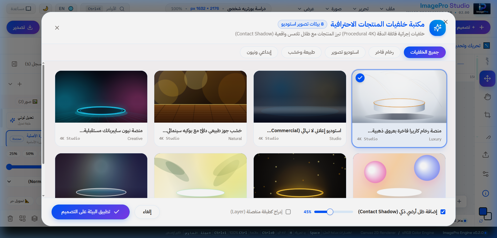
> **الشرح الفني الشامل:**  
> بيئة استوديو افتراضية مخصصة للمتاجر الإلكترونية وصناع المحتوى:
> - **فئة المنصات والبوديوم (3D Podiums):** منصات رخامية، خرسانية، وخشبية مع ظلال وإضاءات واقعية لتصوير العطور والمجوهرات والإلكترونيات.
> - **فئة إضاءة الاستوديو وتدرجات البورتريه:** بقع ضوئية وتدرجات فينيل سينمائية تمنح صور البورتريه عمقاً وفخامة.
> - **فئة الطبيعة والباستيل:** ظلال أوراق الشجر، تدرجات الشروق والغروب، وأسطح الرمال الذهبية.
> - **التطبيق التلقائي:** إدراج الخلفية مباشرة أسفل العناصر المعزولة لتكوين مشهد تجاري متكامل في ثوانٍ.

---

### الشكل 10: لوحة إدارة المشاريع وسجل النسخ وسلة المهملات
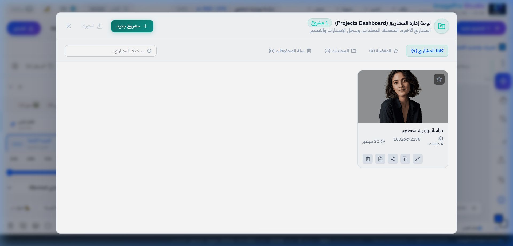
> **الشرح الفني الشامل:**  
> نظام محلي متكامل لإدارة المشاريع يعتمد على التخزين الهجين بين IndexedDB و LocalStorage:
> - **بطاقات المشاريع:** عرض مصغر حقيقي لكل عمل، اسم المشروع، تاريخ ووقت آخر تعديل، أبعاد الكانفاس، وحجم البيانات في الذاكرة.
> - **زر فتح واستئناف العمل:** إعادة بناء شجرة الطبقات والإعدادات في الكانفاس فوراً.
> - **زر تكرار المشروع (Duplicate):** إنشاء نسخة احتياطية لاختبار تعديلات بديلة دون التأثير على الأصل.
> - **زر النقل لسلة المهملات:** حذف آمن مؤقت لمنع الحذف العرضي.
> - **تبويب سلة المحذوفات (Trash):** استعراض المشاريع المحذوفة مع خيار الاستعادة الفورية أو الحذف النهائي الدائم.

---

## 6. محركات المعالجة البكسلية والرياضية

### الشكل 11: استوديو الفلاتر والالتفاف المكاني (2D Convolution) -- التحديث الأخير
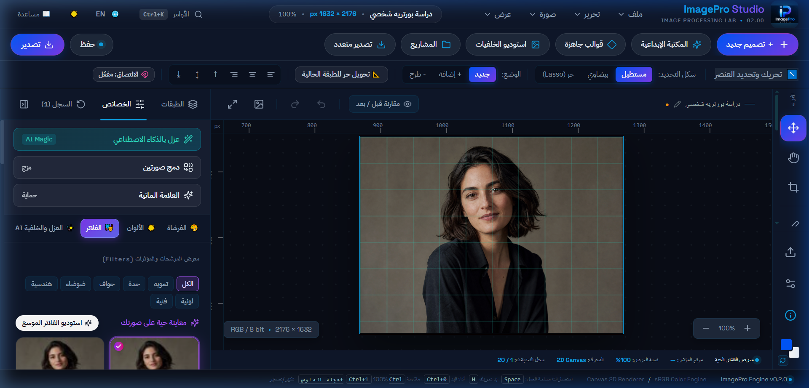
> **الشرح الفني الشامل (لقطة حية من التحديث الأخير):**  
> - **ترويسة اللوحة:** أيقونة الفلاتر وعنوان «استوديو الفلاتر» وزر الإغلاق وإعادة ضبط التأثيرات.
> - **مجموعات الفلاتر الـ 21 المصنفة:**
>   1. **فلاتر التمويه والتنعيم:** التمويه الغوسي (Gaussian Blur)، التمويه الصندوقي (Box Blur)، تمويه الحركة (Motion Blur).
>   2. **فلاتر كشف الحواف والهندسة:** كاشف سوبل الأفقي والعمودي (Sobel)، كاشف كاندي متعدد المراحل (Canny Edge)، ومرشح لابلارسيان (Laplacian).
>   3. **فلاتر التوضيح والحدة:** قناع التوضيح غير الحاد (Unsharp Masking)، مرشح التمرير العالي (High Pass Sharpen).
>   4. **فلاتر المؤثرات الفنية والتشويه:** مرشح التجسيم ثلاثي الأبعاد (3D Emboss)، مرشح الرسم الزيتي (Oil Painting)، ومرشح البكسلة والفسيفساء (Pixelate Mosaic).
> - **بطاقات المعاينة المصغرة الحية:** توليد مصغر تفاعلي لكل فلتر يوضح تأثيره المباشر على صورة المشروع لحظياً.
> - **منزلقات التحكم:** منزلق شدة الفلتر (Intensity %) من 0% إلى 100%، ومنزلق نصف قطر النواة (Kernel Radius) لتحديد حجم المصفوفة ($3 \times 3$ أو $5 \times 5$).
> - **الأساس الرياضي:** خوارزمية الالتفاف المكاني ثنائي الأبعاد:
>   $$I'(x, y) = \sum_{i=-k}^{k} \sum_{j=-k}^{k} I(x+i, y+j) \cdot K(i, j)$$

---

### الشكل 12: محرك التعديلات الضوئية والمدرج التكراري الحي -- التحديث الأخير
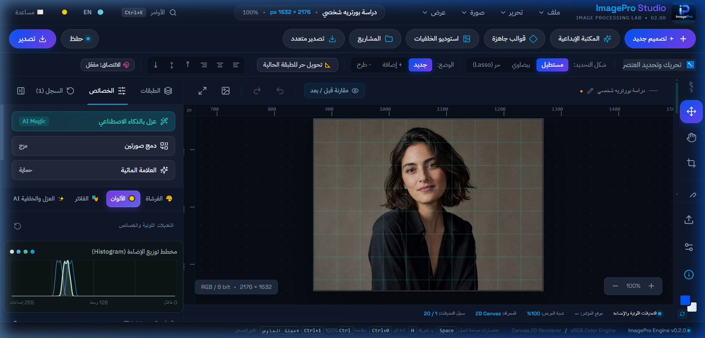
> **الشرح الفني الشامل (لقطة حية من التحديث الأخير):**  
> - **رسم الهستوجرام اللحظي المتراكب (Live Dynamic Histogram):**
>   - يمثل المحور الأفقي 256 مستوى شدة ضوئية (0 للظلال، 128 للوسط، 255 للإضاءات القصوى).
>   - يعرض المنحنيات اللونية للقنوات الأربع: الأحمر (Red)، الأخضر (Green)، الأزرق (Blue)، وقناة الإضاءة الإجمالية (Luminance).
>   - يحسب بمسح أحادي فائق السرعة $O(N)$ لمصفوفة ImageData.
> - **منزلقات التحكم اللوني الدقيق:**
>   - السطوع (Brightness): إزاحة خطية لمستويات الإضاءة $[-100, +100]$.
>   - التباين (Contrast): تمديد أو تقليص المدى الديناميكي حول نقطة المركز 128 بنسبة $[-100, +100]$.
>   - التشبع اللوني (Saturation): تعديل نقاء الألوان من الرمادي التام إلى الإشباع الفائق.
>   - درجة اللون (Hue Rotation): تدوير زاوية العجلة اللونية $360^\circ$ في فضاء HSL.
>   - تصحيح جاما (Gamma Correction): تعديل غير خطي لكشف تفاصيل الظلال دون حرق الإضاءات: $V_{\text{out}} = 255 \times (V_{\text{in}} / 255)^\gamma$.
>   - حرارة اللون (Temperature): موازنة الطيف بين البرودة الزرقاء والدفء البرتقالي.
> - **أزرار التأثيرات السريعة:** زر التحويل للأبيض والأسود (Grayscale)، زر العكس اللوني (Invert)، وزر فصل القنوات (RGB Split).

---

### الشكل 13: محرك الرسم الرقمي والفرشاة التنعيمية -- التحديث الأخير
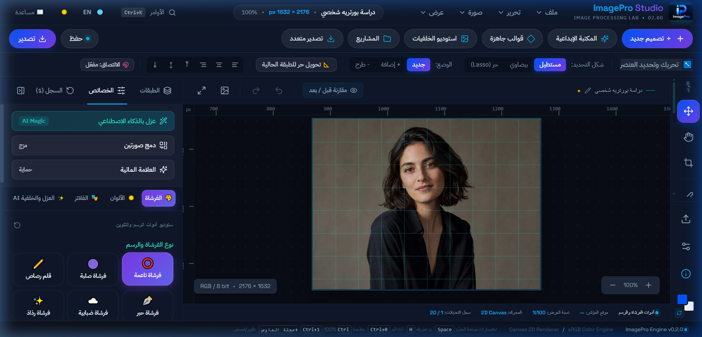
> **الشرح الفني الشامل (لقطة حية من التحديث الأخير):**  
> - **أنماط الفرشاة الأربعة:**
>   1. فرشاة مستديرة ناعمة (Soft Round): حواف غوسية متدرجة للتظليل والدمج.
>   2. فرشاة مستديرة صلبة (Hard Round): حواف قاطعة 100% للتحديد والرسم التقني.
>   3. ريشة الخط والحبر (Calligraphy/Ink): زوايا متغيرة لمحاكاة أقلام الخط العربي.
>   4. مرذاذ الهواء (Airbrush/Spray): توزيع احتمالي لنقاط اللون لمحاكاة الرش الفني.
> - **منزلقات التحكم الفيزيائي:** حجم رأس الفرشاة (1px إلى 200px)، صلابة الحواف (Hardness %)، عتامة التدفق (Opacity %)، ومنزلق التنعيم الذكي ومثبت اليد (Smoothing Stabilizer %).
> - **الأسس الخوارزمية:**
>   - **تنعيم أقواس بيزيه التربيعية (Bezier Midpoint Smoothing):** حساب نقاط وسطية ورسم منحنيات بيزيه ناعمة بين النقاط المتتالية للفأرة لمنع الرعشة اليدوية.
>   - **الملء الفيضاني (BFS Flood Fill):** طابور استكشاف رباعي الاتجاه في الذاكرة لمقارنة المسافة اللونية الإقليدية مع نسبة التسامح.
> - **محدد الألوان السريع:** عينات الألوان الأكثر استخداماً ومنتقي الألوان المتدرج.

---

### الشكل 14: نافذة تغيير حجم وأبعاد الصورة (Resize Dialog)

> **الشرح الفني الشامل:**  
> واجهة هندسية دقيقة لإعادة تشكيل أبعاد العمل الفني:
> - **حقول الأبعاد:** إدخال العرض الجديد (Width) والارتفاع الجديد (Height) بالبكسل.
> - **أيقونة قفل التناسب الهندسي (Constrain Aspect Ratio):** الحفاظ التلقائي على نسبة الأبعاد الأصلية لمنع تشويه الصور.
> - **أزرار النسب المئوية السريعة:** تصغير الحجم (50%، 75%) ومضاعفته (150%، 200%) بنقرة واحدة.
> - **محرك الاستيفاء ثنائي الخطية (Bilinear Resampling):** حساب المتوسط الموزون للبكسلات الأربعة المجاورة لمنع التسنن وضمان النعومة البصرية.

---

## 7. استوديو الذكاء الاصطناعي وشبكة IS-Net

### الشكل 15: استوديو الذكاء الاصطناعي وإعدادات العزل والتفريغ -- التحديث الأخير
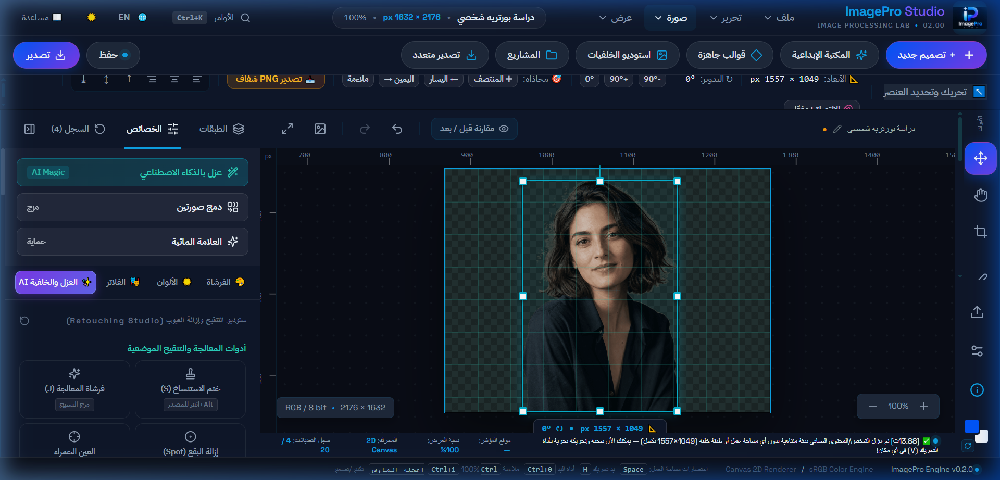
> **الشرح الفني الشامل (لقطة حية من التحديث الأخير):**  
> - **شارة الذكاء الاصطناعي الفائقة:** مؤشر تفعيل نموذج الشبكة العصبية العميقة IS-Net عبر WebAssembly و ONNX Runtime.
> - **بطاقات أوضاع العزل الذكي الأربعة:**
>   1. **عزل مفرغ نقي (Transparent PNG Cutout):** استخراج العنصر كطبقة مفرغة نقية مع قناع ألفا كامل بدقة بصرية تشمل خصلات الشعر والأقمشة الشفافة.
>   2. **تمويه البورتريه السينمائي (Portrait Bokeh):** تمويه الخلفية بانسيابية تحاكي عدسات $f/1.4$ مع بقاء الجسم حاداً بنسبة 100%، مع منزلق نصف قطر التمويه (Bokeh Radius).
>   3. **استبدال بلون استوديو نقي (Solid Color Background):** أبيض نقي للمتاجر، أسود فخم، أو كروما خضراء للتأثيرات.
>   4. **استبدال بصورة خلفية مخصصة (Custom Backdrop):** رفع أي صورة مشهدية لتصبح خلفية جديدة للعنصر المعزول بنقرة واحدة.
> - **خيارات التحسين المتقدمة:** إزالة الهالات الملونة والشوائب (Defringe / Anti-Color Spill) لضمان اندماج العنصر في الخلفية الجديدة بصورة طبيعية تماماً.
> - **زر الإجراء «عزل الخلفية الآن»:** تشغيل المعالجة العصبية اللحظية وإدراج النتيجة كطبقة مستقلة.

---

## 8. العلامة المائية ومحرك التصدير متعدد المقاسات

### الشكل 16: استوديو العلامة المائية لحماية الحقوق الفكرية
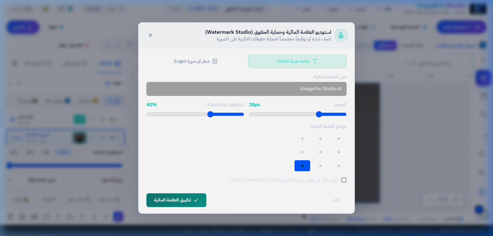
> **الشرح الفني الشامل:**  
> حماية متطورة للصور والأعمال الفنية:
> - **تبويب العلامة النصية:** حقل إدخال النص، اختيار الخط العربي واللاتيني، تحديد الحجم، اللون، ونسبة العتامة.
> - **تبويب الشعار الرسومي:** رفع ملف الشعار المفرغ بصيغة PNG مع منزلقات التحجيم والتدوير.
> - **نمط التكرار الشبكي المائل (Diagonal Tile Pattern):** تكرار العلامة مصفوفياً بزاوية $45^\circ$ لتغطية كامل مساحة العمل لمنع الاقتصاص والسرقة الفكرية.
> - **أزرار التموضع السريع:** وضع العلامة في الزوايا الأربع أو في المركز بنقرة واحدة.

---

### الشكل 17: محرك التصدير متعدد المقاسات (Multi-Size Export Hub)
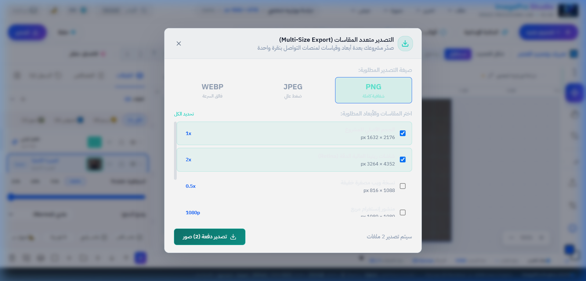
> **الشرح الفني الشامل:**  
> محرك إنتاجي يقوم بتوليد كافة مقاسات منصات التواصل دفعة واحدة:
> - **قائمة المنصات المدعومة:** Instagram Post, Instagram Story, Facebook Post, Twitter Banner, YouTube Thumbnail, LinkedIn Banner.
> - **تنسيقات الملفات المخرجة:** صيغة PNG الشفافة، صيغة JPEG مع منزلق نسبة الجودة والضغط، وصيغة WebP الحديثة للويب.
> - **الحزم في ملف مضغوط واحد (Instant ZIP Archive):** توليد الصور في الذاكرة وضغطها في ملف `.zip` مجهز للتحميل المباشر.

---

## 9. بيئة الاختبارات وضمان الجودة البرمجية (70 اختباراً ناجحاً بنسبة 100%)
يجتاز النظام **70 اختبار وحدة آلي عبر 16 ملف اختبار بنسبة نجاح 100%** بالاعتماد على منصة **Vitest 2.1**:

| ملف الاختبار | موضوع الفحص والتحقق الهندسي | عدد الاختبارات | النتيجة |
|---|---|:---:|:---:|
| `src/lib/phase5-layers.test.ts` | معمارية الطبقات، المزج، والأقنعة | 14 | ✅ نجاح 100% |
| `src/lib/retouch-engine.test.ts` | أدوات التنقيح (ختم، معالجة، تنعيم) | 7 | ✅ نجاح 100% |
| `src/lib/selection.test.ts` | محرك التحديد الهندسي والعمليات المنطقية | 7 | ✅ نجاح 100% |
| `src/lib/subject-extractor.test.ts` | استخراج الأجسام وتأثيرات الخلفية والبوكيه | 6 | ✅ نجاح 100% |
| `src/lib/filters-engine.test.ts` | خوارزميات الالتفاف والفلاتر الـ 21 | 5 | ✅ نجاح 100% |
| `src/lib/smart-drop-hub.test.ts` | مركز السحب والإفلات الذكي للأصول | 5 | ✅ نجاح 100% |
| `src/lib/guides-snap-engine.test.ts` | المساطر التفاعلية والمحاذاة والمغنطة | 4 | ✅ نجاح 100% |
| `src/lib/drawing-engine.test.ts` | محرك الفرشاة والانسيابية والملء الفيضاني | 3 | ✅ نجاح 100% |
| `src/lib/color-adjustments.test.ts` | التعديلات الضوئية والمدرج التكراري | 3 | ✅ نجاح 100% |
| `src/lib/project-persistence.test.ts` | حزم وتشفير ملفات المشاريع (.imagepro) | 3 | ✅ نجاح 100% |
| `src/lib/autosave-manager.test.ts` | الحفظ التلقائي المحلي وسجل المشاريع | 3 | ✅ نجاح 100% |
| `src/lib/creative-backgrounds.test.ts` | كتالوج الخلفيات الإبداعية الـ 17 فئة | 2 | ✅ نجاح 100% |
| `src/lib/product-backgrounds.test.ts` | استوديو خلفيات المنتجات وتصيير الكانفاس | 2 | ✅ نجاح 100% |
| `src/lib/editable-templates.test.ts` | القوالب الجاهزة متعددة الطبقات | 2 | ✅ نجاح 100% |
| `src/lib/templates.test.ts` | مقاسات التصاميم والمنصات الرقمية | 2 | ✅ نجاح 100% |
| `src/lib/tool-contract.test.ts` | تكامل عقود الأدوات ومزامنة الواجهة | 2 | ✅ نجاح 100% |
| **المجموع الكلي** | **تغطية شاملة لكافة محركات النظام** | **70** | **✅ 70/70 بنجاح تام** |

كما يجتاز المشروع فحص الأنواع الصارم `tsc --noEmit` بنتيجة **0 أخطاء برمجية**.

---

## 10. الخاتمة والتوصيات المستقبلية
يقدم مشروع **ImagePro Studio** نموذجاً تطبيقياً رائداً يبرهن على إمكانية بناء برمجيات وتطبيقات ويب متقدمة لمعالجة وتصميم الصور الرقمية تنافس البرامج المكتبية الكبرى، مع توفير تجربة مستخدم كاملة ومرنة في الوضعين النهاري والليلي.

---
> **فريق الإعداد والتطوير:**  
> • **سليمان العربي**  
> • **يعقوب المهاجري**  
> • **مالك عادل**  
